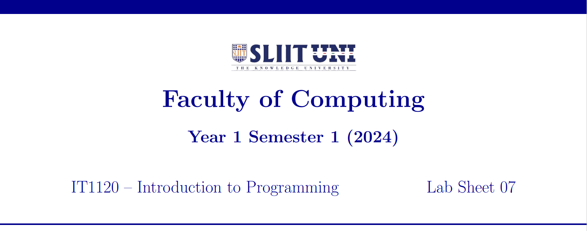
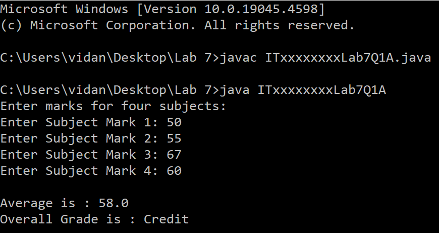

  

    
  

### Question 1 (Tutorial 6 – Q1)

**a)** Write a Java program to display the grade of a student.

The user should enter marks for four subjects and find the average. The overall grade (based on average) is assigned as follows:

| Marks         | Grade        |
|---------------|--------------|
| 100 - 75      | Distinction  |
| 74 - 50       | Credit       |
| 49 - 0        | Fail         |

Save the file inside '**Lab 7**' folder as: **ITxxxxxxxxLab7Q1A.java**  
Replace 'ITxx xxx xxx' of the filename, with your own Student ID.

Expected Output:

  

    
  

### Question 2 (Tutorial 6 – Q2)

Expected Output:

  

    
  

### Question 3 (Tutorial 6 – Q3)

Expected Output:

  

    
  

  

    
  

